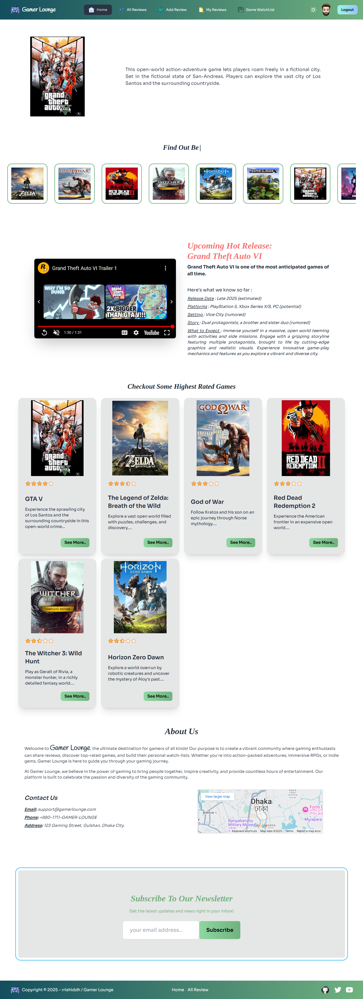
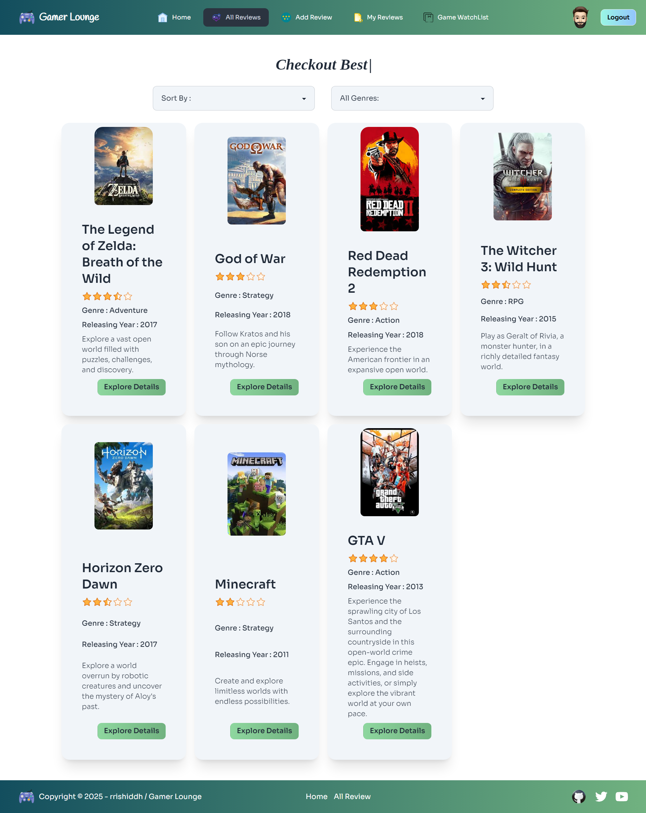
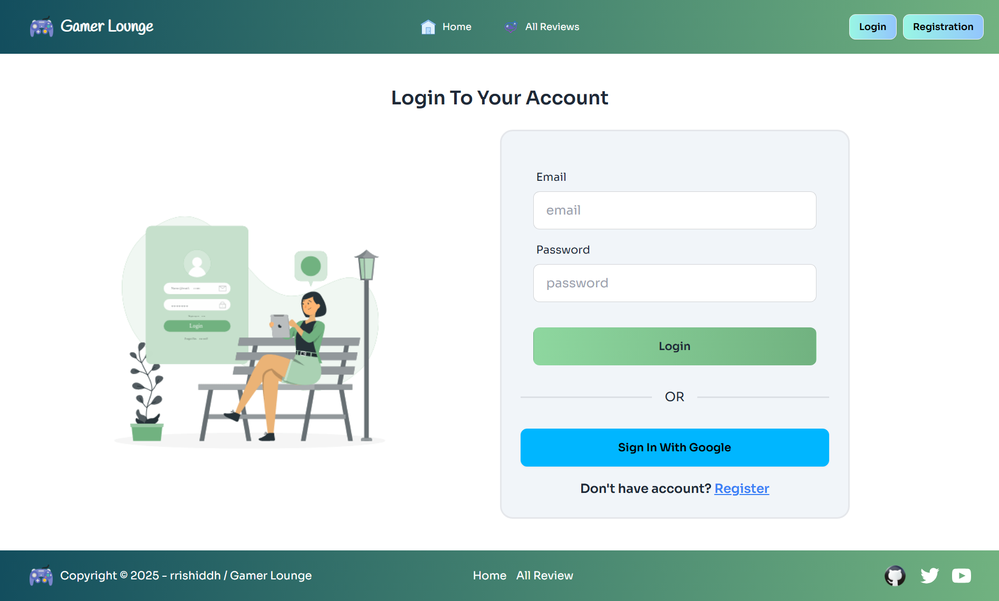

#  Gamer Lounge✨

## Project Name: Gamer Lounge

### A brief description: 
- Gamer Lounge is a user-friendly game review application. The goal of this project is to design a platform where users can explore and share game reviews. The key features of this project is - user authentication and review management to enhance the user experience. The application have a clean and responsive UI, focusing on simplicity and functionality to provide a "chill" experience.  

---

### Main Technology used in this project:
- Frontend Framework: React is employed to develop a user-friendly game review platform, providing a responsive and engaging interface.
- Routing: React Router is implemented to enable smooth navigation between different views within the application.
- State Management: The Context API is utilized to handle global state management across various components.
- Styling: Tailwind CSS is adopted to ensure a clean and consistent design language throughout the application.
- Package Management: NPM is employed for efficient management of project dependencies.

### Purpose:

- The purpose of Gamer Lounge is to create an efficient, scalable, and visually appealing game review platform where users can explore and share experience about game. It is built with modern web technologies, ensuring fast performance and smooth interactivity.
  

### Main Key Features Of This Project:

- Backend Database Handling: Implement robust CRUD operations on the backend database to manage user data, reviews, and other relevant information. Integrate these operations seamlessly into the frontend to ensure data persistence and synchronization. 
- User Authentication: Secure user registration and login using Firebase Authentication, with options for email/password and Google sign-in
- Dynamic Navigation: Context API ensure count and other elements update (specially reviews) in real time.
- React Routing: Smooth navigation between pages with protected and public route handling.
- Product Management: Display products dynamically with sorting and filtering options for an optimized shopping experience.

### NPM Packages I've Used First Time:
- React Awesome Reveal : React Awesome Reveal is a versatile and user-friendly React component library that allows to create stunning and dynamic reveal animations for web applications. 
- React-tooltip : React-Tooltip is a popular and lightweight React library designed to create interactive tooltips that enhance user experience and provide additional information on hover or click.
- React-Iframe : React-Iframe is a simple and efficient React component designed to embed iframes within your React applications. It provides a declarative way to manage iframes, ensuring smooth integration and optimal performance.

### Dependencies:
- @smastrom/react-rating: ^1.5.0
- firebase: ^11.0.2
- localforage: ^1.10.0
- match-sorter: ^8.0.0
- motion: ^11.16.0
- prop-types: ^15.8.1
- react: ^18.3.1
- react-awesome-reveal: ^4.2.14
- react-dom: ^18.3.1
- react-fast-marquee: ^1.6.5
- react-iframe: ^1.8.5
- react-responsive-carousel: ^3.2.23
- react-router-dom: ^7.0.2
- react-simple-typewriter: ^5.0.1
- react-tooltip: ^5.28.0
- sort-by: ^1.2.0
- sweetalert2: ^11.14.5

### How to run on local machine?
1. Open your terminal or command prompt.

2. Use the git clone command followed by the repository URL:-  git clone 'repository-url'

- Replace 'repository-url' with the actual URL of the Git repository you want to clone.

3. To run the project: Navigate to the project directory:- cd 'directory-name' 

4. Run 'npm install' to install project dependencies.

5. Environment setup:Create a '.env.local' file and put your firebase environment variable there. Save the following variable:
- VITE_apiKey='YOUR_FIREBASE_API_KEY'
- VITE_authDomain='YOUR_FIREBASE_AUTH_DOMAIN'
- VITE_projectId='YOUR_FIREBASE_PROJECT_ID'
- VITE_storageBucket='YOUR_FIREBASE_STORAGE_BUCKET'
- VITE_messagingSenderId='YOUR_FIREBASE_MESSAGING_SENDER_ID'
- VITE_appId='YOUR_FIREBASE_APP_ID'

6. Run 'npm run dev' to run the project locally.

##  Live Link: 
### 1. Netlify : [Gamer Lounge](https://gamer-lounge-rrishiddh.netlify.app/)
### 2. Surge : [Gamer Lounge](https://gamer-lounge-rrishiddh.surge.sh/)

### 

##  GitHub Repo Link: 
###  Server Side : [https://github.com/rrishiddh/Gamer-Lounge-Server](https://github.com/rrishiddh/Gamer-Lounge-Server)

##  Site Preview: 
 

  
   
  
   
  

### 

